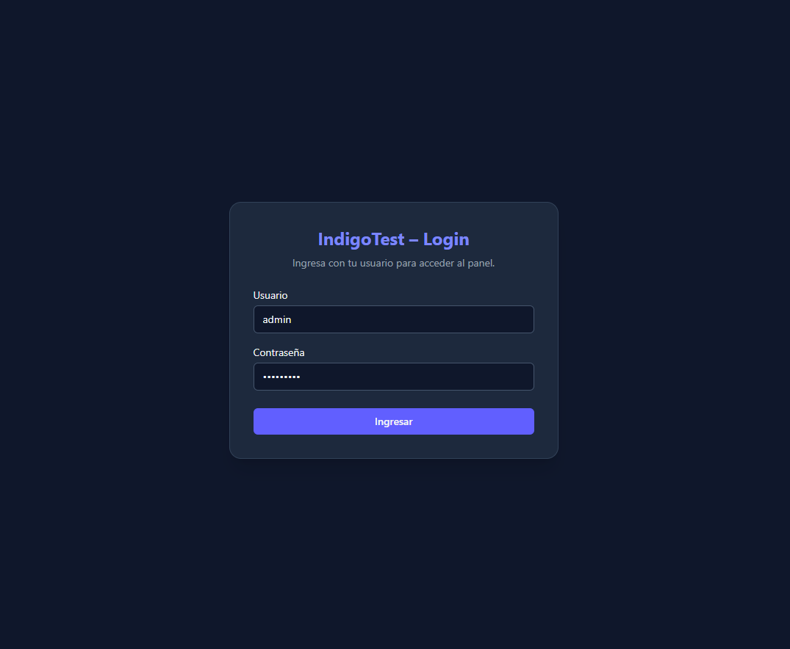
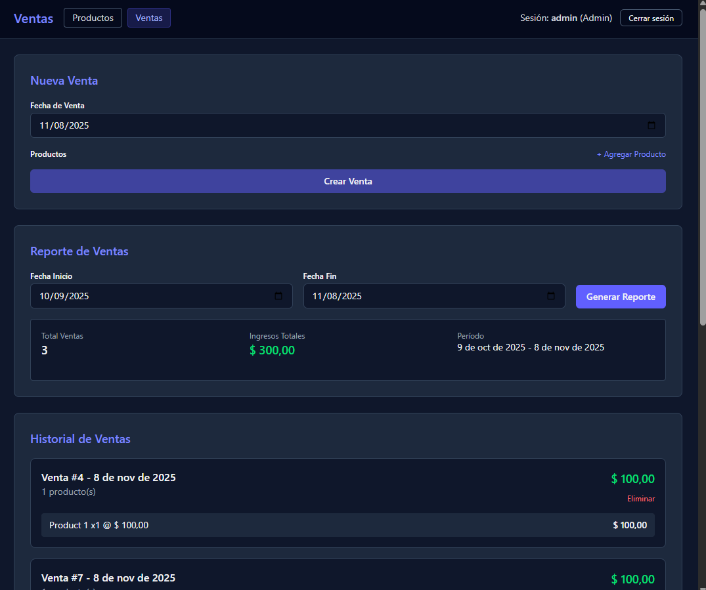

# IndigoTest - Sistema de Gestión de Productos y Ventas

Sistema completo de gestión de inventario y ventas desarrollado con .NET 8 (Backend) y React + TypeScript (Frontend).

## 📋 Tabla de Contenidos

- [Descripción](#-descripción)
- [Características](#-características)
- [Tecnologías](#-tecnologías)
- [Requisitos Previos](#-requisitos-previos)
- [Instalación](#-instalación)
- [Ejecución](#-ejecución)
- [Estructura del Proyecto](#-estructura-del-proyecto)
- [Documentación API](#-documentación-api)
- [Capturas de Pantalla](#-capturas-de-pantalla)
- [Tablero Kanban](#-tablero-kanban)
- [Contribución](#-contribución)

## 🎯 Descripción

IndigoTest es una aplicación web full-stack que permite gestionar productos y realizar ventas con control automático de inventario. El sistema incluye autenticación JWT, gestión de productos con imágenes, procesamiento de ventas y generación de reportes.

## ✨ Características

### Módulo de Productos
- ✅ CRUD completo de productos
- ✅ Gestión de imágenes (Azure Blob Storage)
- ✅ Control de stock
- ✅ Validaciones de negocio

### Módulo de Ventas
- ✅ Creación de ventas con múltiples productos
- ✅ Actualización automática de stock
- ✅ Validación de stock disponible
- ✅ Historial de ventas
- ✅ Reportes por rango de fechas
- ✅ Restauración de stock al eliminar ventas

### Autenticación y Seguridad
- ✅ Autenticación JWT
- ✅ Rutas protegidas
- ✅ Roles de usuario

## 🛠 Tecnologías

### Backend
- **.NET 8** - Framework principal
- **Entity Framework Core** - ORM
- **SQLite** - Base de datos
- **AutoMapper** - Mapeo de objetos
- **JWT Bearer** - Autenticación
- **Swagger/OpenAPI** - Documentación API
- **Azure Blob Storage** - Almacenamiento de imágenes

### Frontend
- **React 19** - Biblioteca UI
- **TypeScript** - Tipado estático
- **Vite** - Build tool
- **React Router** - Navegación
- **Tailwind CSS** - Estilos
- **Axios/Fetch** - Cliente HTTP

## 📦 Requisitos Previos

Antes de comenzar, asegúrate de tener instalado:

- [.NET 8 SDK](https://dotnet.microsoft.com/download/dotnet/8.0)
- [Node.js](https://nodejs.org/) (v18 o superior)
- [npm](https://www.npmjs.com/) o [yarn](https://yarnpkg.com/)
- [Git](https://git-scm.com/)

### Opcional
- [Visual Studio 2022](https://visualstudio.microsoft.com/) o [VS Code](https://code.visualstudio.com/)
- Cuenta de Azure Storage (para almacenamiento de imágenes)

## 🚀 Instalación

1. **Clonar el repositorio**
   ```bash
   git clone <url-del-repositorio>
   cd indigotest
   ```

2. **Configurar el Backend**
   ```bash
   cd backend/src/Api
   ```
   
   Ver instrucciones detalladas en [backend/README.md](./backend/README.md)

3. **Configurar el Frontend**
   ```bash
   cd frontend
   ```
   
   Ver instrucciones detalladas en [frontend/README.md](./frontend/README.md)

## ▶️ Ejecución

### Desarrollo

1. **Iniciar el Backend**
   ```bash
   cd backend/src/Api
   dotnet run
   ```
   
   El backend estará disponible en: `http://localhost:5000` o `https://localhost:5001`
   
   Swagger UI: `http://localhost:5000/swagger`

2. **Iniciar el Frontend** (en otra terminal)
   ```bash
   cd frontend
   npm install
   npm run dev
   ```
   
   El frontend estará disponible en: `http://localhost:5173`

### Producción

Ver las instrucciones específicas en los README de cada módulo:
- [Backend README](./backend/README.md#producción)
- [Frontend README](./frontend/README.md#producción)

## 📁 Estructura del Proyecto

```
indigotest/
├── backend/
│   └── src/
│       ├── Api/              # API REST (Controllers, Program.cs)
│       ├── Application/      # Lógica de negocio (Services, DTOs)
│       ├── Domain/           # Entidades del dominio
│       ├── Infrastructure/   # Persistencia (DbContext, Repositories)
│       └── data/             # Base de datos SQLite
├── frontend/
│   └── src/
│       ├── api/              # Cliente API
│       ├── auth/             # Contexto de autenticación
│       ├── components/       # Componentes reutilizables
│       └── pages/            # Páginas de la aplicación
└── README.md                 # Este archivo
```

## 📚 Documentación API

Cuando el backend esté ejecutándose, puedes acceder a la documentación interactiva de la API en:

**Swagger UI**: `http://localhost:5000/swagger`

La API incluye los siguientes endpoints:

### Autenticación
- `POST /api/auth/login` - Iniciar sesión

### Productos
- `GET /api/products` - Listar productos
- `GET /api/products/{id}` - Obtener producto por ID
- `POST /api/products` - Crear producto
- `PUT /api/products/{id}` - Actualizar producto
- `DELETE /api/products/{id}` - Eliminar producto

### Ventas
- `GET /api/sales` - Listar ventas
- `GET /api/sales/{id}` - Obtener venta por ID
- `POST /api/sales` - Crear venta
- `DELETE /api/sales/{id}` - Eliminar venta
- `GET /api/sales/report` - Generar reporte de ventas

## 📸 Capturas de Pantalla

> **Nota**: Agrega aquí capturas de pantalla de la aplicación en funcionamiento.

### Página de Login


### Página de Productos


### Pagina de Ventas y Reporte de Ventas


## 📊 Tablero Kanban

Sigue el progreso del proyecto en nuestro tablero Kanban:

🔗 **[Ver Tablero Kanban](https://github.com/users/JuanLozada97/projects/5)**

## 👥 Contribución

1. Fork el proyecto
2. Crea una rama para tu feature (`git checkout -b feature/AmazingFeature`)
3. Commit tus cambios (`git commit -m 'Add some AmazingFeature'`)
4. Push a la rama (`git push origin feature/AmazingFeature`)
5. Abre un Pull Request

## 📝 Licencia

Este proyecto es privado y de uso interno.

---

**Desarrollado con ❤️ usando .NET y React**

